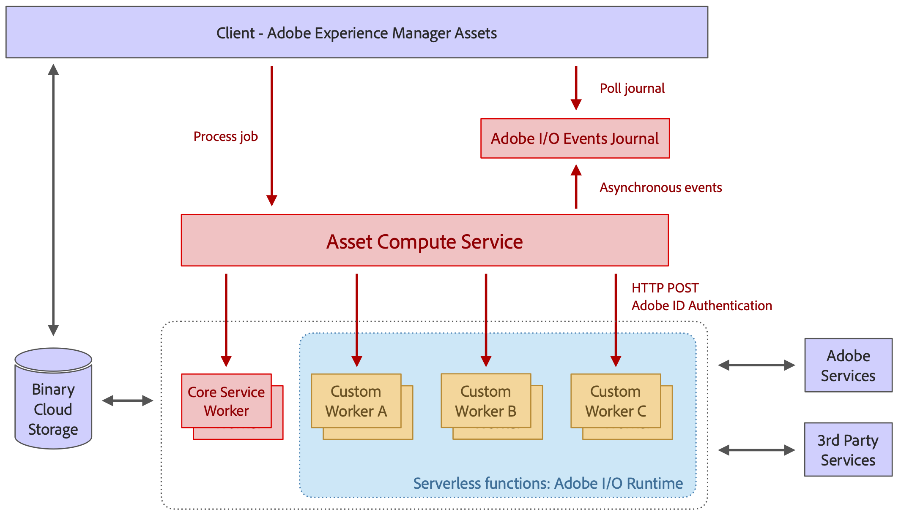

# Architectuur van [!DNL Asset Compute Service] {#overview}

De [!DNL Asset Compute Service] is bovenop serverless gebouwd [!DNL Adobe I/O] Runtime platform. Het biedt ondersteuning voor Adobe Sensei-inhoudsservices voor elementen. De aanroepende client (alleen [!DNL Experience Manager] als [!DNL Cloud Service] wordt ondersteund) wordt voorzien van de door Adobe Sensei gegenereerde informatie die zij voor het actief heeft aangevraagd. De geretourneerde informatie heeft de JSON-indeling.

[!DNL Asset Compute Service] is uitbreidbaar door aangepaste toepassingen te maken op basis van [!DNL Project Adobe Developer App Builder]. Deze aangepaste toepassingen zijn [!DNL Project Adobe Developer App Builder] toepassingen zonder kop en voer taken uit zoals aangepaste conversieprogramma&#39;s of roep externe API&#39;s aan om afbeeldingsbewerkingen uit te voeren.

[!DNL Project Adobe Developer App Builder] is een framework voor het ontwikkelen en implementeren van aangepaste webtoepassingen op [!DNL Adobe I/O] runtime. Om aangepaste toepassingen te maken, kunnen ontwikkelaars [!DNL React Spectrum] (UI toolkit van Adobe), creeer microservices, creeer douanegebeurtenissen, en orkest APIs. Zie [documentatie van Adobe Developer App Builder](https://developer.adobe.com/app-builder/docs/overview).

De basis waarop de architectuur is gebaseerd, is onder meer:

* De modulariteit van toepassingen - die slechts wat voor een bepaalde taak vereist bevat - staat toe om toepassingen van elkaar te loskoppelen en hen lichtgewicht te houden.

* Het serverloze concept van [!DNL Adobe I/O] Runtime levert talrijke voordelen op: asynchrone, hoogst scalable, geïsoleerde, op baan-gebaseerde verwerking, die perfect voor activaverwerking past.

* Binaire cloudopslag biedt de benodigde functies voor het afzonderlijk opslaan en openen van elementbestanden en uitvoeringen, zonder dat volledige toegangsrechten voor de opslag vereist zijn, met behulp van vooraf ondertekende URL-verwijzingen. Dankzij overdrachtsversnelling, CDN-caching en colocatie van computertoepassingen met cloudopslag hebt u optimale toegang tot content met lage latentie. Zowel AWS- als Azure-wolken worden ondersteund.

*Afbeelding: Architectuur van [!DNL Asset Compute Service] en de manier waarop het geïntegreerd is met [!DNL Experience Manager], opslag en verwerkingstoepassing.*

De architectuur bestaat uit de volgende onderdelen:

* **Een API- en orkestlaag** ontvangt verzoeken (in formaat JSON) die de dienst instrueren om een bronactiva in veelvoudige vertoningen om te zetten. De aanvragen zijn asynchroon en retourneren met een activerings-id, dat wil zeggen taak-id. Instructies zijn louter declaratief en voor alle standaardverwerkingswerkzaamheden (bijv. miniatuurproductie, tekstextractie) geven consumenten alleen het gewenste resultaat aan, maar niet de toepassingen die bepaalde uitvoeringen verwerken. Algemene API-functies zoals verificatie, analyse en snelheidsbeperking worden verwerkt met behulp van de Adobe API Gateway vóór de service en beheert alle aanvragen die naar [!DNL Adobe I/O] Runtime. De toepassing die verplettert wordt dynamisch gedaan door de orchestratielaag. Aangepaste toepassingen kunnen door clients worden opgegeven voor specifieke uitvoeringen en aangepaste parameters bevatten. De uitvoering van de toepassing kan volledig parallel lopen aangezien zij afzonderlijke serverfuncties in zijn [!DNL Adobe I/O] Runtime.

* **Toepassingen om elementen te verwerken** die gespecialiseerd zijn in bepaalde bestandsindelingen of doeluitvoeringen. Conceptueel, is een toepassing als het Unix pijpconcept: een invoerbestand wordt omgezet in een of meer uitvoerbestanden.

* **A [algemene toepassingsbibliotheek](https://github.com/adobe/asset-compute-sdk)** Hiermee worden algemene taken afgehandeld, zoals het downloaden van het bronbestand, het uploaden van de uitvoeringen, het melden van fouten, het verzenden en controleren van gebeurtenissen. Dit is zo ontworpen dat het ontwikkelen van een toepassing zo eenvoudig mogelijk blijft, na het serverloze idee, en kan worden beperkt tot lokale bestandssysteeminteracties.

<!-- TBD:

* About the YAML file?
* minimize description to custom applications
* remove all internal stuff (e.g. Photoshop application, API Gateway) from text and diagram
* update diagram to focus on 3rd party custom applications ONLY
* Explain important transactions/handshakes?
* Flow of assets/control? See the illustration on the Nui diagrams wiki.
* Illustrations. See the SVG shared by Alex.
* Exceptions? Limitations? Call-outs? Gotchas?
* Do we want to add what basic processing is not available currently, that is expected by existing AEM customers?
-->
